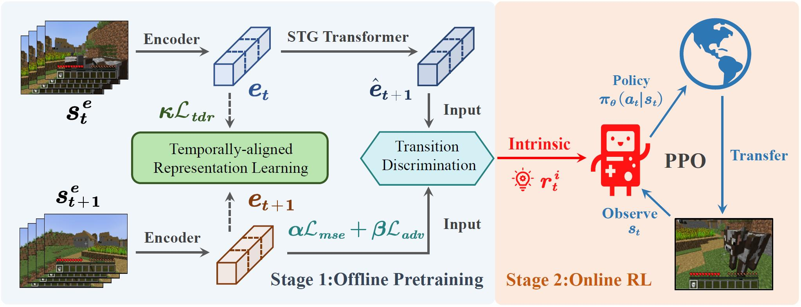

# [NeurIPS 2023] Learning from Visual Observation via Offline Pretrained State-to-Go Transformer



This is the official implementation of "Learning from Visual Observation via Offline Pretrained State-to-Go Transformer" which has been accepted by NeurIPS 2023. A two-stage method, named **STG**, is proposed for reinforcement learning from visual observation.  

- In the first stage, State-to-Go (STG) Transformer is pretrained offline to predict and differentiate latent transitions of demonstrations. 
- In the second stage, the STG Transformer provides intrinsic rewards for downstream reinforcement learning tasks.

Experiments are conducted in two video game environments: Atari and Minecraft. Codes & instructions about Atari can refer to  **atari** and **minecraft** directory respectively.

## To begin
```
pip clone https://github.com/zhoubohan0/STG-Transformer
```


## Citation

Our paper is available on [arxiv](https://arxiv.org/abs/2306.12860) and you can access our [website](https://sites.google.com/view/stgtransformer) for more infomation. If you find our code useful or want to conduct further research based on STG, please consider citing us!

```bibtex
@article{zhou2023learning,
  title={Learning from Visual Observation via Offline Pretrained State-to-Go Transformer},
  author={Zhou, Bohan and Li, Ke and Jiang, Jiechuan and Lu, Zongqing},
  journal={arXiv preprint arXiv:2306.12860},
  year={2023}
}
```


## Acknowledgement

We acknowledge [cleanrl](https://github.com/vwxyzjn/cleanrl) to provide a clear and simple implementation of PPO and SAC algorithm for our project. And the codebase from [Plan4MC](https://github.com/PKU-RL/Plan4MC) enables us to collect enough expert trajectories and  to tackle Minecraft tasks.

## License

MIT License
